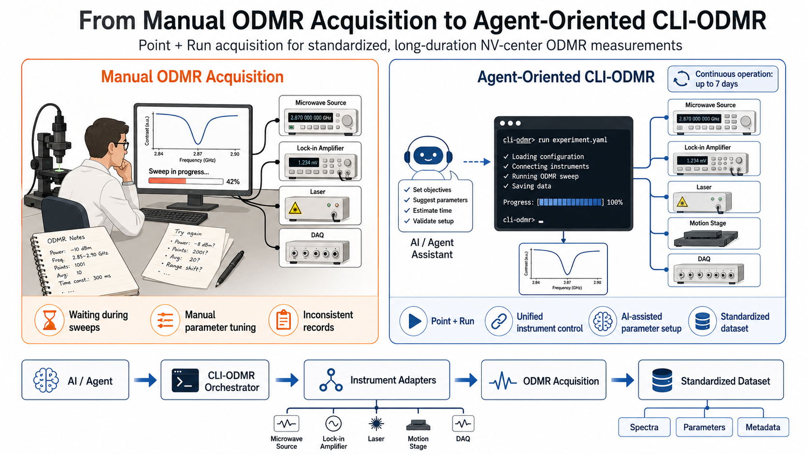
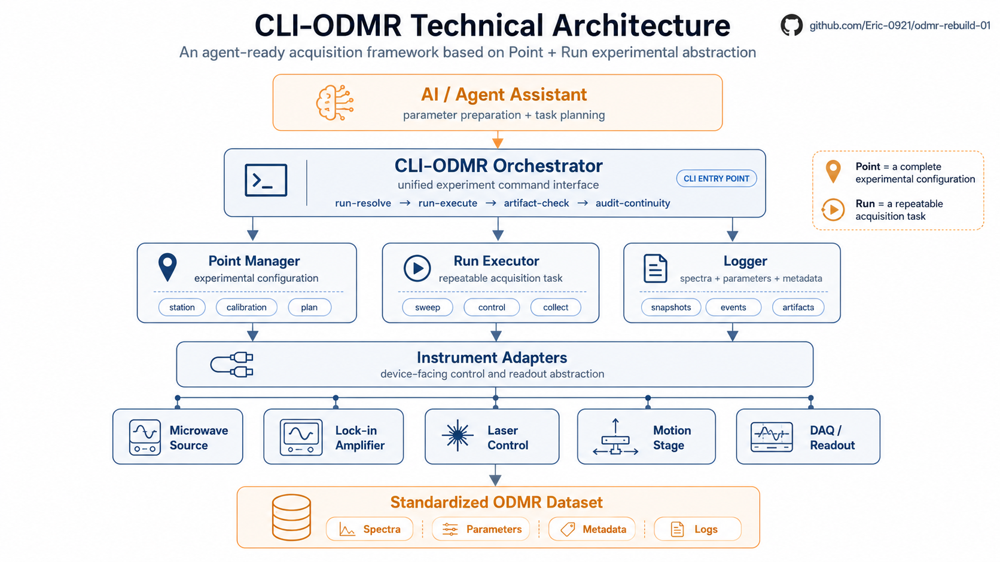

# CLI-ODMR: Agent-Ready ODMR Acquisition Framework

[中文说明](README.zh-CN.md)

CLI-ODMR is a reproducible command-line acquisition framework for NV-center ODMR experiments.  
Instead of treating each measurement as an ad hoc manual operation, this project models experiments as:

- `Point`: one complete experimental configuration
- `Run`: one repeatable acquisition task over many points

The current goal is not to rebuild a large GUI. The goal is to build a verified, traceable, long-duration acquisition backbone that can run on real instruments and leave auditable artifacts behind.

## Why This Project

Traditional ODMR acquisition often depends on manual parameter tuning, fragmented notes, and operator presence during long sweeps. That makes reproducibility, scaling, and dataset building unnecessarily hard.

CLI-ODMR moves the workflow toward:

- standardized `Point + Run` execution
- unified instrument control through a CLI
- agent-assisted experiment preparation
- structured artifacts for replay, review, and downstream analysis

## Workflow Transition



## Technical Architecture



## What It Does

- Resolves one experiment from six JSON inputs: `station`, `calibration`, `plan`, `smb-profile`, `oe-profile`, `laser-profile`
- Executes repeatable ODMR runs with real instruments on Windows
- Keeps lock-in collection as a run-level continuous data stream
- Maps continuous acquisition back to point-level experimental meaning
- Writes structured artifacts for spectra, parameters, metadata, events, and audit
- Supports offline review with `artifact-check` and `audit-continuity`

## Current Stack

The production acquisition stack is Windows C# on .NET 8:

- `tools/win-csharp/Odmr.Devices`: device transports and command helpers
- `tools/win-csharp/Odmr.Runtime`: config resolve, runtime, point loop
- `tools/win-csharp/Odmr.Artifacts`: artifact writing, contract checks, continuity audit
- `tools/win-csharp/Odmr.WinProbe`: CLI entry point

Python is kept out of the real-time acquisition path. It is used for:

- config generation
- console/UI shell
- offline post-processing

## Supported Instrument Roles

- Microwave source: `SMB100A`
- Lock-in amplifier: `OE1022D` or `OE1300`
- Motion / magnetic control: `M8812`
- Laser control: `CNI Laser PSU-SR`

## Core CLI Flow

```text
run-resolve -> run-execute -> artifact-check -> audit-continuity
```

This is the stable acquisition path. Probe and diagnostic commands are kept separate from the formal runtime contract.

## Quick Start

Build the C# solution:

```powershell
dotnet build tools/win-csharp/Odmr.Win.sln
```

Resolve one run without touching devices:

```powershell
dotnet run --project tools/win-csharp/Odmr.WinProbe -- run-resolve `
  --station configs/stations/lab_a.json `
  --calibration configs/calibrations/main.json `
  --plan configs/plans/minimal_3point_runtime.json `
  --smb-profile configs/profiles/smb100a_run_pll_default.json `
  --oe-profile configs/profiles/oe1022d_run_ch_b_observed.json `
  --laser-profile configs/profiles/cni_laser_run_off_background.json
```

Execute one run:

```powershell
dotnet run --project tools/win-csharp/Odmr.WinProbe -- run-execute `
  --station configs/stations/lab_a.json `
  --calibration configs/calibrations/main.json `
  --plan configs/plans/minimal_3point_runtime.json `
  --smb-profile configs/profiles/smb100a_run_pll_default.json `
  --oe-profile configs/profiles/oe1022d_run_ch_b_observed.json `
  --laser-profile configs/profiles/cni_laser_run_off_background.json `
  --out-dir runs/win_csharp_manual_minimal
```

Check artifacts and continuity:

```powershell
dotnet run --project tools/win-csharp/Odmr.WinProbe -- artifact-check --run runs/win_csharp_manual_minimal
dotnet run --project tools/win-csharp/Odmr.WinProbe -- audit-continuity --run runs/win_csharp_manual_minimal --out runs/win_csharp_manual_minimal/continuity_audit.json
```

## Repository Structure

```text
configs/              station, calibration, plan, and profile JSON
docs/rebuild/         architecture, runtime contracts, artifact schema, lab facts
tools/win-csharp/     production acquisition stack
tools/config-generator/
tools/odmr-console-python/
tools/odmr-postprocess/
tools/plan-json-generator/
runs/                 run outputs, ignored by git
```

## Reliability Boundary

This repository takes acquisition reliability seriously:

- continuous collection is treated as a frozen hot path
- runtime truth lives in artifacts, not in GUI state
- failures must leave enough evidence for replay and audit
- Python does not directly control instruments in the real-time acquisition loop

For `OE1022D`, the current validated hot path is intentionally minimal:

```text
write RALL?
sleep 30ms
blocking exact read 12288B
direct-decode
append collector truth and decoded CSV artifacts
```

## Documentation Map

- Project scope: `docs/rebuild/00_scope.md`
- Architecture: `docs/rebuild/01_architecture.md`
- Artifact schema: `docs/rebuild/03_artifact_schema.md`
- Device command rules: `docs/rebuild/04_device_command_specs.md`
- Device connection facts: `docs/rebuild/06_device_connection_facts.md`
- Verified runtime baseline: `docs/rebuild/08_verified_command_and_runtime_baseline.md`
- Run and config guide: `docs/rebuild/09_运行与配置手册.md`
- C# primary stack boundary: `docs/rebuild/13_csharp_primary_stack.md`
- Reliability without live frontend: `docs/rebuild/14_experiment_reliability_without_live_frontend.md`

## For Summer Research Visitors

This repository is best read as a system-design and experimental-automation project, not only as a codebase.

The main ideas to look at are:

- how an ODMR experiment is abstracted into `Point` and `Run`
- how heterogeneous lab instruments are normalized into one CLI workflow
- how long-duration acquisition is made auditable
- how structured datasets are produced for later physics analysis or machine learning

## License

No license file is currently declared in this repository.
